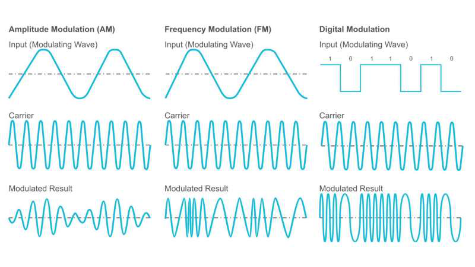

You will hear a few weird terms thrown around this weekend, but one of the most basic ones you might hear is "Modulation" This describes how the sound from your voice gets mixed with the radio waves and transmitted. The operator should be able to describe to you how this works, but if you can't folow along, that doesn't matter anyways, just have fun.

The diagram below explains the various ways that radio waves are modulated to send a signal. Not shown are two very common methods, Morse Code, also known as CW, and Single Side Band, usually abbreviated to SSB. Morse is basically AM, but rapidly switched on and off SSB is effectively AM, but divided in half.

